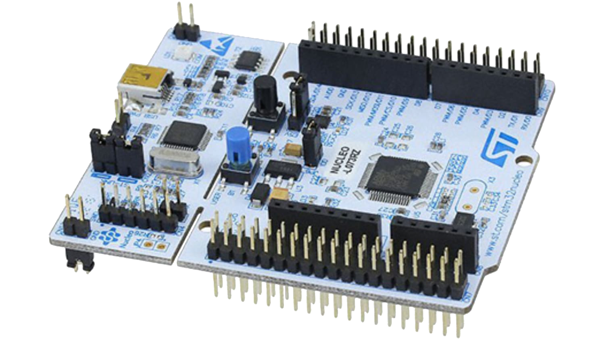

# Nucleo stm32 F4 01RE drivers
## about this repository

			

- this repository caotains examples of <b>STM32F401RE</b> or ( <b>NUCLEO-F401RE</b> ) from scratch  
			- ( note that we are not using stm32cubeMX here )
we will use basic includes ( <b>STM32F401xx.h</b> which have basic adresses of different registers in our mcu ),

 
		
  </a>

 

 
### first BLINK
- blink.c contains description of all the code 